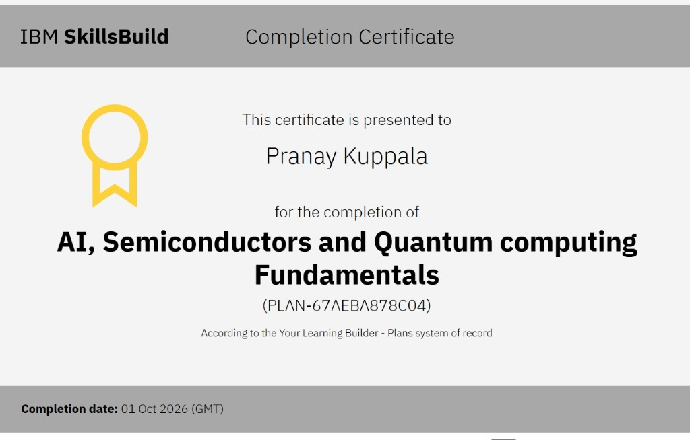

# ⚛️ Credential Dossier: AI, Semiconductors and Quantum Computing Fundamentals

## 📄 Overview

* **Recipient:** Pranay Kuppala ([@mikeypro-7](https://github.com/mikeypro-7))
* **Issuing Organization:** IBM SkillsBuild
* **System of Record:** Your Learning Builder - Plans system of record
* **Plan ID:** `PLAN-67AEBA878C04`
* **Date Completed:** October 01, 2026
* **Status:** Verified ✅
* **LinkedIn Verification:** [Add to LinkedIn Profile](https://www.linkedin.com/profile/add?startTask=CERTIFICATION_NAME&name=AI%2C+Semiconductors+and+Quantum+computing+Fundamentals&organizationName=IBM+SkillsBuild&issueYear=2026&issueMonth=10&certUrl=https%3A%2F%2Fgithub.com%2Fmikeypro-7%2FCertifications&certId=PLAN-67AEBA878C04)

---

## 🖼️ Certificate Document

  

---

## 🎯 Curriculum & Core Competencies Mastered

### 1. Artificial Intelligence (AI)
* **Core Machine Learning:** Supervised, unsupervised, and reinforcement learning principles.
* **Deep Neural Networks:** Architecture of layers, activation functions, loss optimization, and gradient descent.
* **AI Ethics & Responsible Computing:** Bias mitigation, data fairness, model explainability, and real-world deployment safety.

### 2. Semiconductor Technology & Microelectronics
* **Solid-State Physics:** Band gap theory, semiconductor materials (Silicon, Gallium Nitride, etc.), and p-n junction physics.
* **Transistor Logic & Scaling:** MOSFET operation, Moore's Law dynamics, advanced lithography nodes, and gate-all-around (GAA) architectures.
* **Packaging & System Integration:** Chiplets, 2.5D/3D advanced packaging, and thermal management in high-performance computing.

### 3. Quantum Computing Foundations
* **Quantum Mechanical Principles:** Superposition, entanglement, and quantum state representation using Dirac bra-ket notation.
* **Qubits vs. Classical Bits:** Bloch sphere representation, decoherence, and error mitigation.
* **Quantum Gates & Circuit Models:** Pauli gates, Hadamard transform, CNOT gates, and introductory quantum algorithm design (Qiskit fundamentals).

---

[← Return to Wiki Home](./Home.md)
