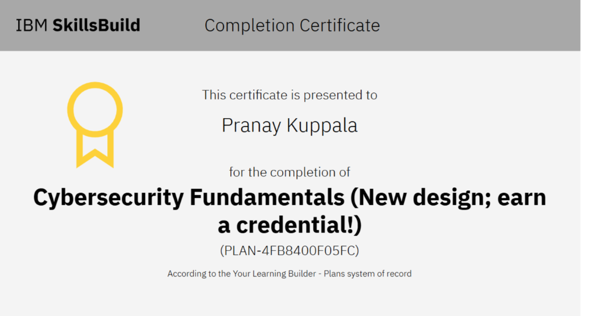

# 🛡️ Credential Dossier: Cybersecurity Fundamentals

## 📄 Overview

* **Recipient:** Pranay Kuppala ([@mikeypro-7](https://github.com/mikeypro-7))
* **Issuing Organization:** IBM SkillsBuild
* **System of Record:** Your Learning Builder - Plans system of record
* **Plan ID:** `PLAN-4FB8400F05FC`
* **Date Completed:** October 02, 2026
* **Status:** Verified ✅
* **LinkedIn Verification:** [Add to LinkedIn Profile](https://www.linkedin.com/profile/add?startTask=CERTIFICATION_NAME&name=Cybersecurity+Fundamentals&organizationName=IBM+SkillsBuild&issueYear=2026&issueMonth=10&certUrl=https%3A%2F%2Fgithub.com%2Fmikeypro-7%2FCertifications&certId=PLAN-4FB8400F05FC)

---

## 🖼️ Certificate Document

  

---

## 🎯 Curriculum & Core Competencies Mastered

### 1. Information Security Governance & Foundations
* **The CIA Triad:** Applying Confidentiality, Integrity, and Availability across enterprise systems.
* **Risk Management Frameworks:** Threat modeling, vulnerability scanning, and risk assessment strategies.
* **Security Policies & Compliance:** Best practices for data privacy, regulatory compliance, and security standard implementations.

### 2. Threat Landscape & Attack Methodologies
* **Malware Taxonomy:** Analysis of viruses, worms, trojans, ransomware, spyware, and rootkits.
* **Social Engineering:** Phishing vectors, spear phishing, credential harvesting, and physical security awareness.
* **Network Attack Surfaces:** Man-in-the-Middle (MitM), Denial of Service (DoS/DDoS), DNS spoofing, and port scanning tactics.

### 3. Defensive Architectures & Controls
* **Identity and Access Management (IAM):** Role-Based Access Control (RBAC), multi-factor authentication (MFA), and zero-trust principles.
* **Network Security Perimeter:** Firewalls, Intrusion Detection/Prevention Systems (IDS/IPS), network segmentation, and VPN security.
* **Cryptography Essentials:** Symmetric vs. asymmetric encryption, hashing algorithms (SHA-256), digital signatures, and Public Key Infrastructure (PKI).

### 4. Incident Response & Security Operations
* **Security Operations Center (SOC) Functions:** Log aggregation, event correlation, and telemetry analysis.
* **Incident Handling Lifecycle:** Preparation, detection & analysis, containment, eradication, recovery, and post-incident review.

---

[← Return to Wiki Home](./Home.md)
